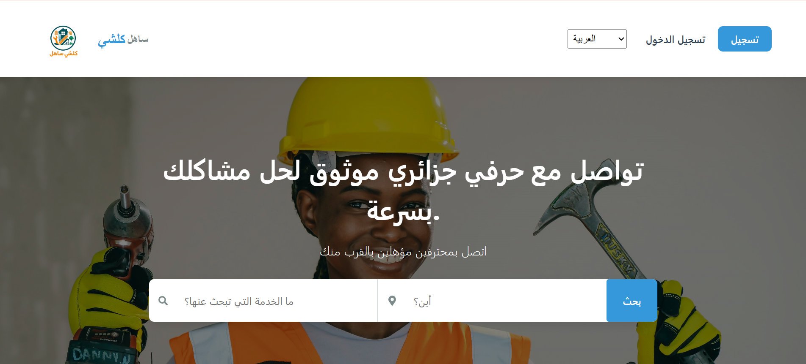
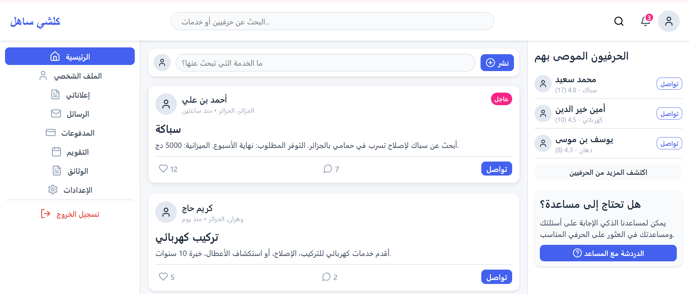
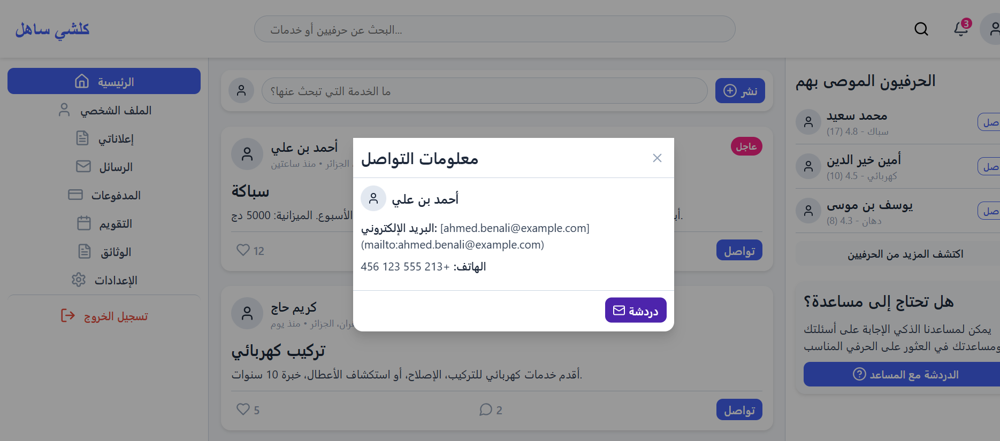
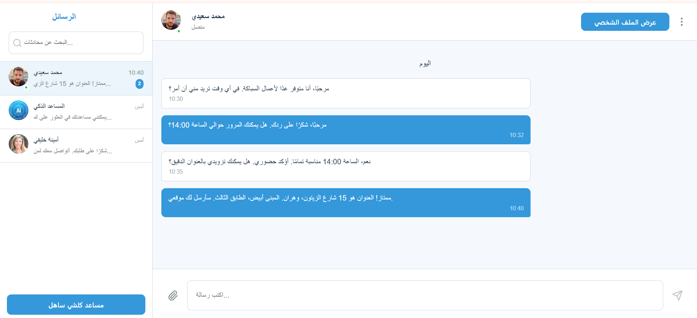

# 💼 Travo DZ – Plateforme de Recrutement et Freelance en Algérie

**Travo DZ** est une application web dédiée à la **connexion entre chercheurs d’emploi, freelances et recruteurs**. Elle permet aux utilisateurs de **publier des offres**, **postuler à des missions** et **gérer leur activité professionnelle** en ligne, de manière simple et efficace.

---

## Fonctionnalités principales :

- 📢 Publication d’offres d’emploi et de missions freelance.
- 🧑‍💻 Création de profils professionnels pour postuler facilement.
- 🔎 Recherche intelligente d’opportunités par secteur, localisation, ou type de contrat.
- 📂 Gestion des candidatures envoyées et reçues.
- 💬 Communication directe entre recruteurs et candidats.

---

## Aperçu visuel de l'application

---

## Objectif :
Offrir une solution professionnelle 100% en ligne pour **trouver du travail**, **collaborer en freelance**, et **simplifier le recrutement** pour les entreprises et particuliers en Algérie.

---

## Lien d’accès :
[Accéder à Travo DZ](https://www.fennecpannel.com/travo/)

---

## Auteur :
Développé par [fares-chaima](https://github.com/fares-chaima)
